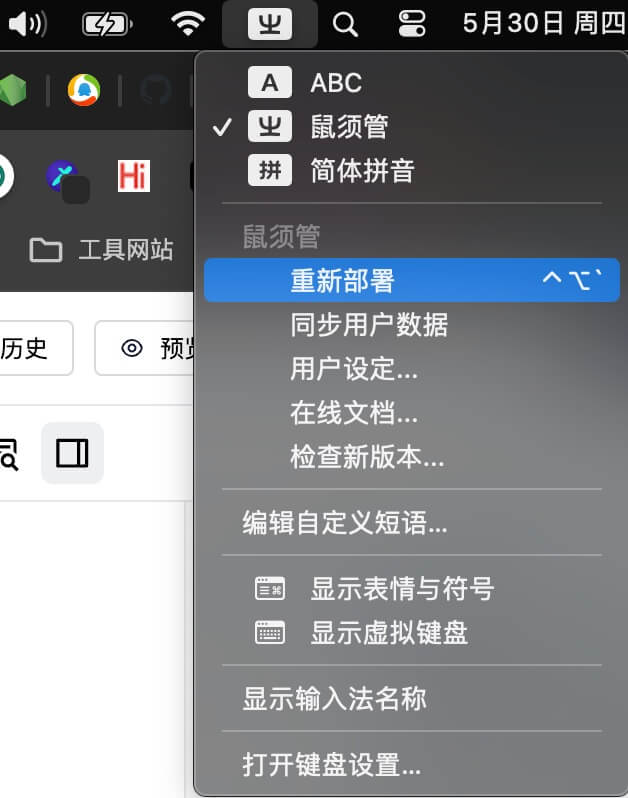
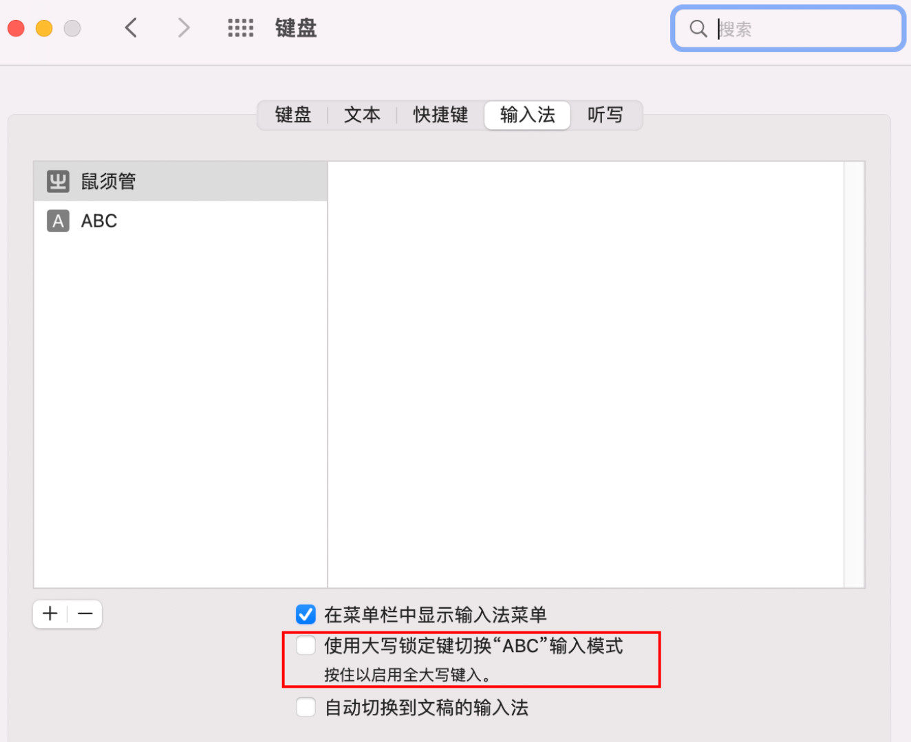

# 雾凇拼音

## MAC安装
1. 安装rime输入法
官网：https://rime.im/
安装完成后要注销重启

2. 去键盘输入那里选择鼠鬚管输入法


3. 点击所有输入法 ——>再点击+ 号


4. 再点击简体中文 ——> 鼠鬚管 ——> 添加
注意一定要点击简体中文 ，不然可能不会显示可选择的输入法


5. 安装雾凇拼音
先安装rime输入法管理器
```
curl -fsSL https://raw.githubusercontent.com/rime/plum/master/rime-install | bash
进入plum目录, 然后执行
bash rime-install voocel/rime-config:others/recipes/full
```

6. 然后点击鼠鬚管 输入法，选择重新部署 即可


7. 卸载其他输入法
打开finder ，按组合键⌘+shift+G ，输入/Library/Input Methods  右键卸载输入法

## 配置
1. 目录结构
```
.
├── default.yaml   # 一些全局设置

├── rime_ice.schema.yaml  # 全拼方案
├── double_pinyin*.yaml   # 双拼方案
├── rime_ice.dict.yaml    # 挂载词库
├── cn_dicts/             # 词库目录

├── melt_eng.schema.yaml  # 英文方案，作为次翻译器挂载到拼音方案
├── melt_eng.dict.yaml    # 挂载词库
├── en_dicts/             # 词库目录

├── radical_pinyin.schema.yaml  # 部件拆字方案，作为反查挂载到拼音方案
├── radical_pinyin.dict.yaml    # 部件拆字词库

├── custom_phrase.txt    # 自定义短语
├── symbols_v.yaml       # 全拼 v 模式
├── symbols_caps_v.yaml  # 双拼 V 模式
├── opencc/              # 词语映射，Emoji
├── rime.lua             # 引入 Lua 脚本
├── lua/                 # 各个 Lua 脚本

├── squirrel.yaml  # 鼠须管的前端配置文件
└── weasel.yaml    # 小狼毫的前端配置文件

```

2. 配置地址
2.1 配置目录 / 用户文件夹：
- 鼠须管： ~/Library/Rime
- 小狼毫： %APPDATA%\Rime
2.2 共享目录 / 程序文件夹：
- 鼠须管： /Library/Input Methods/Squirrel.app/Contents/SharedSupport
- 小狼毫： <安装目录>\data

自己的配置放到配置目录里就可以。共享目录提供了一些自带的方案及各项默认配置，可以直接引用；无特殊需求，不要修改共享目录的文件。

注意编辑器的缩进配置。
Rime 的 YAML 配置文件需要严格的缩进，使用两个空格缩进，不要用 Tab。
词库文件的词条是用 Tab 分割的：
```
拼音	pin yin 1234
拼音<Tab>pin<Space>yin<Tab>1234
```

3. 中英文切换配置
鼠须管输入法是自带英文输入, 使用shift键切换. 如果想使用Mac标准的caps lock键来切换,需要做以下修改:
- 首先去系统设置里把这个“钩”取消掉



这样我们按caps lock就不会切换到系统自带的英文输入法了
然后修改default.yaml


*注: 这个Caps_Lock从clear修改成commit_code的目的是有时候我们已经不小心在中文模式下输入了一段英文，我们不想切换到英文模式下重新输入，所以直接按”caps lock”就可以把已经打在输入法的英文直接打出来，不需要重新打了。*

重新部署即可
